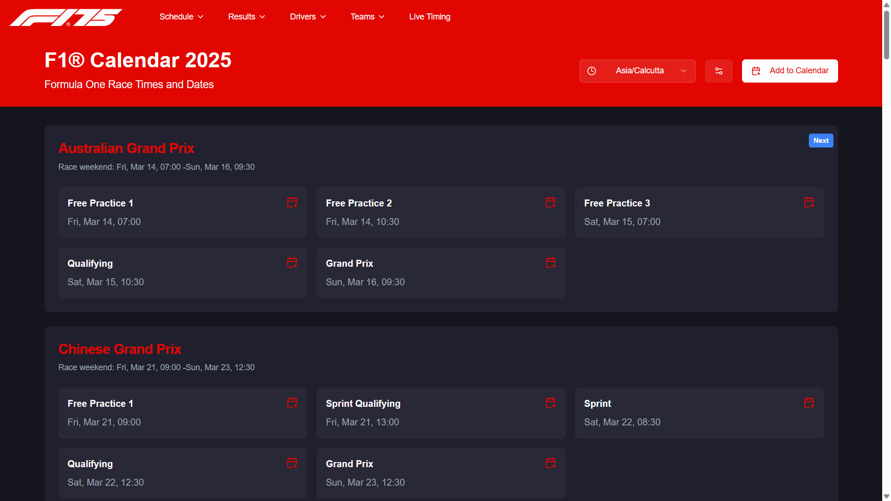
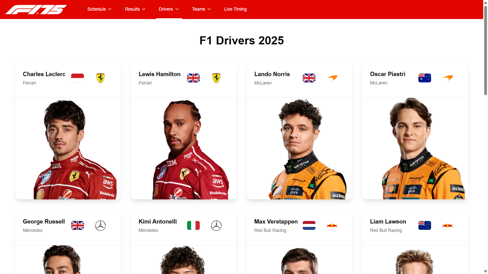
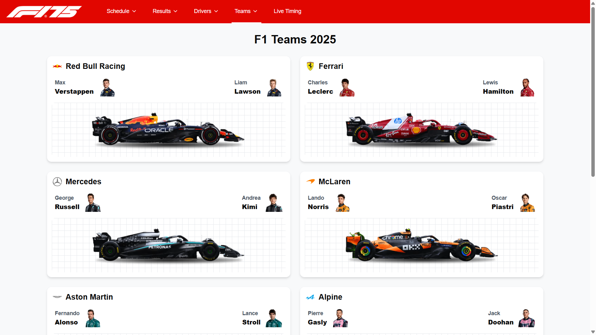

# F1 2025 Calendar/Schedule Project


## Overview

Welcome to the F1 2025 Calendar/Schedule project! This project allows you to seamlessly add your favorite F1 races of the year directly to your Google Calendar. It also provides up-to-date information about standings, teams, cars, drivers, and other F1-related content. Whether you're a seasoned F1 fan or just getting into the sport, this tool will keep you in the loop with all the action.

## Features

- **Google Calendar Integration**: Add F1 races directly to your Google Calendar with ease.
- **Live Standings**: Stay updated with the latest standings of your favorite drivers and teams.
- **Detailed Information**: Access comprehensive information about teams, cars, drivers, and more.
- **User-Friendly Interface**: Enjoy a sleek and intuitive interface built with TypeScript, CSS, and JavaScript.

## Screenshots





## Tech Stack

- **Next.js**
- **TypeScript**
- **TailwindCSS**

## Installation

To get started with this project, follow these steps:

1. **Clone the repository:**

   ```sh
   it clone https://github.com/tejaskarade100/F1.git
   ```
2. **Clone the repository:**

   ```sh
   cd F1
   ```
3. **Navigate to the project directory:**

   ```sh
   npm install
   ```
4. **Run the project:**

   ```sh
   npm run dev
   ```

## Usage

1.Open the application in your browser.

2.Browse through the F1 races and select your favorites.

3.Add selected races to your Google Calendar with a single click.

4.Explore the standings, teams, cars, and drivers sections for detailed information.


## Contributing
We welcome contributions from the community!


## Contact

If you have any questions or suggestions, feel free to reach out:
- GitHub: tejaskarade100 (https://github.com/tejaskarade100)
- Email: (tejaskarade100@gmail.com)
